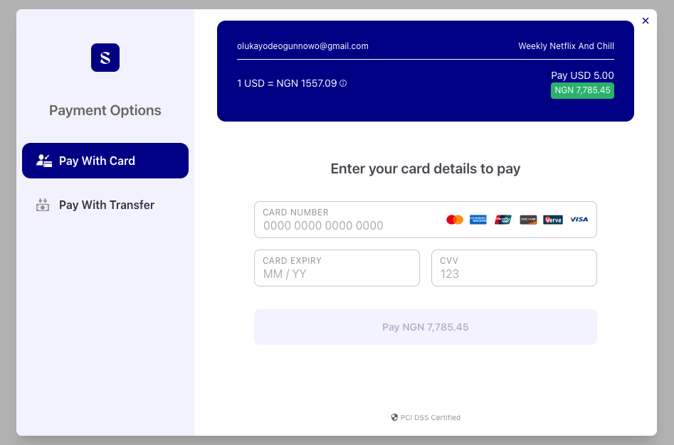

# Spotflow Angular Library

The **Spotflow Angular Sdk** helps you or rather enables users to make payments seamlessly. It integrates smoothly into your application, providing a streamlined checkout experience.

Available Features:

- Collections: Card, Bank Transfers.
- Recurring payments: Tokenization and Subscriptions.

## Table of Contents

1. [Requirements](#requirements)

## Requirements

1. Spoflow Encryption keys
2. Spotflow API keys
3. Node versions >= 16.x.x npm >=7.x.x

## Demo



## Installation

```bash

  $ npm install @spot-flow/ng-spotflow-checkout
# or 
  $ yarn add @spot-flow/ng-spotflow-checkout
# or 
  pnpm add @spot-flow/ng-spotflow-checkout

```

## Initialization

For older version of Angular, you can use the module but for recent, standalone angular version

1 for standard Angular version

```typescript
import { CommonModule } from '@angular/common';
import { SpotflowAngularCheckoutModule } from '@spot-flow/ng-spotflow-checkout';

@NgModule({
  declarations: [AppComponent],
  imports: [CommonModule, SpotflowAngularCheckoutModule],
  providers: [],
  bootstrap: [AppComponent],
})
```

2 for standalone angular version

```typescript

@Component({
  selector: 'app-root',
  standalone: true,
  imports: [ MakePaymentComponent, SpotflowAngularCheckoutModule],
  templateUrl: './app.component.html',
  template: `
  <spotflow-make-payment text="Pay NGN 10" [secret_key]="merchantKey" [plan_id]="planId" [amount]="amount"
    [email]="email" className="btn-primary">
  </spotflow-make-payment>
  `,
  styleUrl: './app.component.scss',
})
export class AppComponent {
  title = 'spotflow-ng-demo';
  // use your Secre API keys <sk_test_f998479c0e******************8dab2>
  merchantKey = 'sk_test_f9984*****************';
  planId = 'a9d53c4c-4452-4d00-953e-bb0f************';
  email = 'oajhdjkna@gamil.com';
  amount = 9;
  currency = 'NGN';
}

```

## Usage

Two ways of using the package

1. [As a commponent](#using-spotflow-as-components)
2. [As a Direct Serive](#using-directly-as-a-service)

### Using Spotflow as components

```typescript

@Component({
  selector: 'app-root',
  standalone: true,
  imports: [ MakePaymentComponent, SpotflowAngularCheckoutModule],
  templateUrl: './app.component.html',
  template: `
  <spotflow-make-payment text="Pay NGN 10" [secret_key]="merchantKey" [plan_id]="planId" [amount]="amount"
    [email]="email" className="btn-primary">
  </spotflow-make-payment>
  `,
  styleUrl: './app.component.scss',
})
export class AppComponent {
  title = 'spotflow-ng-demo';
  // use your Secret API keys <sk_test_f998479c0e******************8dab2>
  merchantKey = 'sk_test_f9984*****************';
  planId = 'a9d53c4c-4452-4d00-953e-bb0f************';
  email = 'oajhdjkna@gamil.com';
  amount = 9;
  currency = 'NGN';
}

```

### Using directly as a service

```typescript

@Component({
  selector: 'app-root',
  standalone: true,
  imports: [RouterOutlet, SpotflowAngularCheckoutModule],
  templateUrl: './app.component.html',
  styleUrl: './app.component.scss',
  providers: [SpotflowAngularCheckoutService],
})
export class AppComponent {
  title = 'spotflow-ng-demo';
  merchantKey = 'sk_test_f998479c0******************8dab27';
  planId = 'a9d53c4c-4452-4d00-953e-************';
  email = 'olu************owo@yupmail.com';
  amount = 9;
  currency = 'NGN';

  constructor(
    private spotflowAngularCheckoutService: SpotflowAngularCheckoutService
  ) {}

  makePayment() {
    const paymentData = {
      amount: this.amount,
      currency: this.currency,
      email: this.email,
      merchantKey: this.merchantKey,
      reference: '',
      plan: this.planId,
    };

    this.spotflowAngularCheckoutService.setup(paymentData);
  }
}

```

### Parameters

Read more about our parameters and how they can be used [here](https://docs.spotflow.one/Developer%20Tools/inline-js).

| Parameter           | Always Required ? |Description     |
| ------------------- | ----------------- | ---------------------------------------------------------------------------------------------------------------------------------------------------------------------------------------------------------------------------------------------- |
| merchantKey         | True              | Your API secret |
| reference           | False             | Your transaction reference. This MUST be unique for every transaction  |
| amount              | False              | Amount to charge the customer. NB: this most likely comes from the plan details    |
| currency            | False             | Currency to charge in. Defaults to NGN                 |
| encryptionKey       | True               | This is the encryption key for the merchant |
| planId   | True | This is the plan id being paid for  |
| firstname | False | This is the Customer First Name |
| lastname | False | This is the Customer Last Name |
| regionId | False | This is the merchant's region where the customer is subscribed to |
| phone | False | This is the phone number of the customer |

## Contribting Guidelines

We welcome contributions from the community. Read more about our community contribution guidelines [here](/CONTRIBUTION.md).

## Supports

## License

By contributing to this library, you agree that your contributions will be licensed under its [MIT license](/LICENSE).

Copyright (c) Spotflow Inc.

## Contributors

- [Olukayode Ogunnowo](http://github.com/dansagam)
- [Oluwatomisin Jimoh](https://github.com/ekiira)
