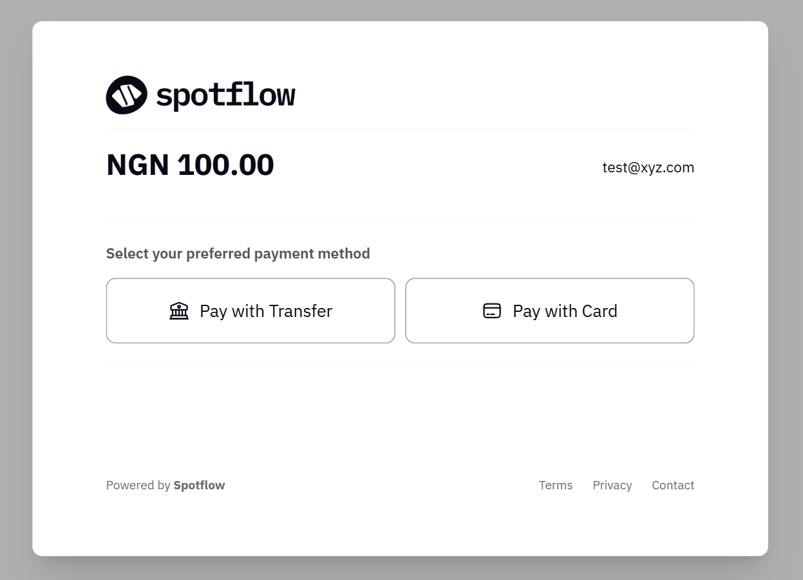

# Spotflow Angular Library

The **Spotflow Angular SDK** enables users to make payments seamlessly. It integrates smoothly into your **Angular** application, providing a streamlined checkout experience.

Available Features:

- Collections: Card, Bank Transfers.
- Recurring Payments: Tokenization and Subscriptions.

## Table of Contents

1. [Requirements](#requirements)
2. [Installation](#installation)
3. [Usage](#usage)
4. [Parameters](#parameters)
5. [License](#license)
6. [Contribution Guidelines](#contribution-guidelines)
7. [Contributors](#contributors)

## Requirements

1. Spoflow Encryption keys
2. Spotflow API keys
3. Node versions >= 16.x.x npm >=7.x.x

## Demo



## Installation

```bash

  $ npm install @spot-flow/ng-spotflow-checkout
# or 
  $ yarn add @spot-flow/ng-spotflow-checkout
# or 
  pnpm add @spot-flow/ng-spotflow-checkout

```

## Usage

[As a component](#using-spotflow-as-components)

**app.component.ts**
```typescript

import { Component } from '@angular/core';
import { RouterOutlet } from '@angular/router';
import { SpotflowAngularCheckoutModule } from '@spot-flow/ng-spotflow-checkout';

@Component({
  selector: 'app-root',
  standalone: true,
  imports: [RouterOutlet, SpotflowAngularCheckoutModule],
  templateUrl: './app.component.html',
  styleUrl: './app.component.css',
})
export class AppComponent {
  title = '';
}
```


**app.component.html**

```html
  <spotflow-make-payment
    text="Pay"
    secret_key="merchantKey"
    email="email"
    [amount]="amount" 
    currency="currency"
    encryption_key="encryptionKey"
    [style]="{ 'background-color': 'black', color: 'white' }"
  >
  </spotflow-make-payment>
  <router-outlet/>
```

### Parameters

Read more about our parameters and how they can be used [here](https://docs.spotflow.one/Developer%20Tools/inline-js).

| Parameter           | Required |Description     |
| ------------------- | ----------------- | ---------------------------------------------------------------------------------------------------------------------------------------------------------------------------------------------------------------------------------------------- |
| merchantKey         | True              | Your API Secret |
| reference           | False             | Your transaction reference. This MUST be unique for every transaction  |
| amount              | False              | Amount to charge the customer. NB: this most likely comes from the plan details. This is not required for subscription payments.   |
| currency            | True             | Currency to charge in.           |
| localCurrency       | False            | This is only required when a payment is being made in USD  |
| encryptionKey       | True               | This is the encryption key for the merchant. This is required for card payments. |
| planId   | False | This is the plan ID being paid for however, this is not required for one time payments.   |
| firstName | False | This is the Customer's First Name |
| lastName | False | This is the Customer's Last Name |
| phone | False | This is the Customer's Phone Number |
| email | True | This is the Customer's Email Address |
| metadata | True | This contains other information about the product such as the product name and other additional properties. Product Name should not be passed if planId is being passed |
| callBackUrl | False | This is the URL the browser redirects to on success of a payment |


## Contribution Guidelines

We welcome contributions from the community. Read more about our community contribution guidelines [here](/CONTRIBUTION.md).

## License

By contributing to this library, you agree that your contributions will be licensed under its [MIT license](/LICENSE).

Copyright (c) Spotflow Inc.